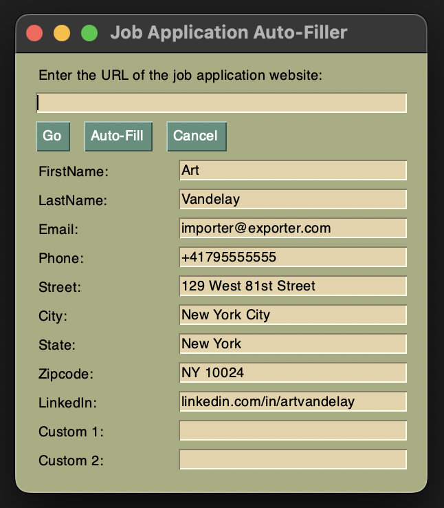
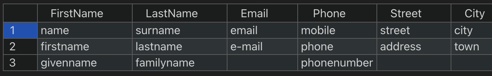

# JobberWacky
### Job Application Companion and Autofiller
## About

The goal of this personal project is to partially automate the tedium of online job applications. The main purpose of JobberWacky to fill common webpage form fields; these usually come with different names, which is accounted for using an internal database and regex expressions.

The application is built in python, using Selenium module for page automation, with JavaScript for webpage element scraping.

## Features
- custom form-fields with naming-variations support
- modular regex field name parsing
- dynamic GUI field rendering
- fall-back GUI copy-paste functionality

## Planned
- csv user data file  import selector
- dropdown selector support is currently being reworked
- (maybe) better window resizing with element scaling
- (maybe) standalone application support for portable use

## Screenshots

Main Gui (v3)

Alternate field name library

## Known Issues
- duplicate filling of similar fields, such as _Address 1_, _Address 2_
